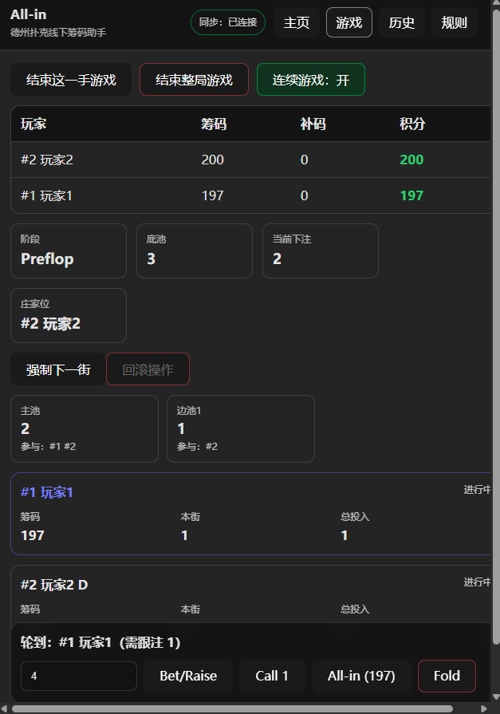

# All-in

[English README](./README.md)

一个用于线下德州扑克局的筹码与整局记录助手（支持多端同步）。

 

## 功能

- 准备阶段：盲注/前注设置、玩家与筹码、庄家位、补码
- 进行中：记录行动、自动计算底池与边池、回滚、强制进入下一街
- 摊牌结算：手动选择胜者（支持平分），也可输入牌面自动判定胜者（可选）
- 积分汇总：每位玩家初始/补码/最终/净值，并可保存到历史记录
- 多端同步：通过 WebSocket（`/sync`）广播局面快照

## 技术栈

- React + TypeScript + Vite
- `ws` 提供 WebSocket 同步（集成在 Vite dev/preview server 内）
- 历史记录以文件形式存储在 `./history/` 目录

## 快速开始

```bash
npm install
npm run dev
```

打开 Vite 输出的地址（通常是 http://localhost:5173）。

## 常用命令

- `npm run dev`：启动开发服务器
- `npm run build`：TypeScript 构建 + 打包
- `npm run lint`：ESLint 检查
- `npm run preview`：用构建产物启动预览服务（同样包含下方 API）

## 内置接口

这些接口由 [vite.config.ts](./vite.config.ts) 里的 Vite 插件提供：

- **WebSocket**：`GET /sync`
  - 将最新的游戏快照广播给所有连接的客户端
- **历史记录 REST API**：
  - `GET /api/history` → 列出 `./history/` 下的 `*.json`
  - `GET /api/history/:name` → 读取单个历史文件
  - `POST /api/history` → 写入一条新的历史记录文件

历史记录会保存到服务器文件系统中的 `./history/` 目录（自动创建）。

## Docker

构建并运行：

```bash
docker build -t allin .
docker run --rm -p 4173:4173 -v "$PWD/history:/app/history" allin
```

或使用 docker compose：

```bash
docker compose up --build
```

当前 `docker-compose.yml` 默认将 `./allin/history` 挂载到 `/app/history`，如需使用 `./history` 可自行调整挂载路径。

## 目录结构

- `src/poker/`：规则引擎与牌力判定
- `src/views/`：页面视图（主页/游戏/历史/规则/汇总）
- `src/hooks/`：同步与状态相关 Hook（WebSocket 快照同步）

## 许可协议

本项目使用 Apache License 2.0，详见 [LICENSE](./LICENSE)。
